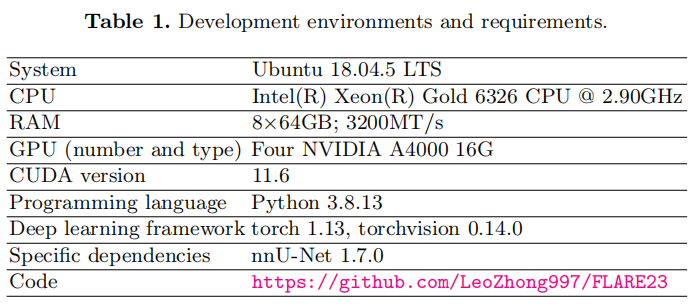

# Solution of Team voxelintelligence for FLARE23 Challenge

Built upon [MIC-DKFZ/nnUNet](https://github.com/MIC-DKFZ/nnUNet) and [Ziyan-Huang/FLARE22](https://github.com/Ziyan-Huang/FLARE22), 
this repository provides the solution of team voxelintelligence for [MICCAI FLARE23](https://codalab.lisn.upsaclay.fr/competitions/12239#learn_the_details-overview) Challenge. 

You can reproduce our method as follows step by step:

## Environments and Requirements:

Install nnU-Net version 1.7.0 [1] as below. You should meet the requirements of nnUNet, our method does not need any additional requirements. For more details, please refer to https://github.com/MIC-DKFZ/nnUNet
```
git clone https://github.com/MIC-DKFZ/nnUNet.git
cd nnUNet
pip install -e .
```
## Dataset
Get public dataset from [FLARE2023](https://codalab.lisn.upsaclay.fr/competitions/12239#learn_the_details-overview).

## Preprocessing
1. Data cleaning or statistical analysis: We perform label analysis to check label completeness. Out of 2200 labeled data, 222 cases include complete organ labels without tumors, and 1497 cases have tumor labels. 
These two subsets are utilized for training our single-task models.
2. Reorientation: As we want the network to predict images regardless of orientation, we reorient the images to the standard RAS orientation during the training phase. 
Later, we will apply mirroring operations in the later stages of data augmentation to enhance the network's orientation robustness.
3. Resampling method for anisotropic data: In order to leverage the physical information within the CT data, all images are resampled to the same resolution of 4.0mm × 1.2mm × 1.2mm
4. Intensity normalization method: Initially, we compute the 0.5 and 99.5 percentiles, as well as the mean and standard deviation of the data intensity. Subsequently, the data is clipped to the 0.5 and 99.5 percentiles, and z-score normalization is applied using the global mean and standard deviation.

## 1. Training base nnUNet model for Pseudo Labeling
### 1.1. Copy the following files in this repo to your nnUNet environment.
```
FLARE23/nnunet/training/network_training/nnUNetTrainerV2_FLARE.py
FLARE23/nnunet/experiment_planning/experiment_planner_FLARE23TumorMedium.py
```
### 1.2. Prepare Labeled Data of FLARE23
```
run FLARE23/nnunet/data_conversion/Task023_FLARE23Tumor.py
```
### 1.3. Conduct automatic preprocessing using nnUNet.
Here we do not use the default setting.
```
nnUNet_plan_and_preprocess -t 23 -pl3d ExperimentPlanner3D_FLARE23Medium -pl2d None
```
### 1.4. Training Medium nnUNet
```
nnUNet_train 3d_fullres nnUNetTrainerV2_FLARE_Medium 23 all -p nnUNetPlansFLARE23TumorMedium --disable_val
```
### 1.5 Prediction
```
nnUNet_predict -i INPUT_FOLDER -o INPUT_FOLDER -t 30 -tr nnUNetTrainerV2_FLARE_Medium -m 3d_fullres -p nnUNetPlansFLARE23TumorMedium -f all --all_in_gpu True --mode fastest --disable_tta -w full --disable_postprocessing
```
## 2. Training nnUNet model for multi-task learning
```
run FLARE23/nnunet/data_conversion/Task030_FLARE23OARTumorMultiLabel.py
nnUNet_plan_and_preprocess -t 30 -pl3d ExperimentPlanner3D_FLARE23TumorMedium -pl2d None --verify_dataset_integrity
nnUNet_train 3d_fullres nnUNetTrainerV2_FLARE_Medium 30 all -p nnUNetPlansFLARE23TumorMedium --disable_val
```
## 3. Training nnUNet model for multi-task learning with mixed dataset of 2200 cases
```
run FLARE23/nnunet/data_conversion/Task033_FLARE23unLabeledOARTumorMultiTask.py
nnUNet_plan_and_preprocess -t 33 -pl3d ExperimentPlanner3D_FLARE23TumorMedium -pl2d None --verify_dataset_integrity
nnUNet_train 3d_fullres nnUNetTrainerV2_FLARE_Medium 33 all -p nnUNetPlansFLARE23TumorMedium --disable_val
```
## 4. Training nnUNet model for multi-task learning with mixed dataset of 4000 cases
```
run FLARE23/nnunet/data_conversion/Task034_FLARE23noLabeledOARTumorMultiTask.py
nnUNet_plan_and_preprocess -t 34 -pl3d ExperimentPlanner3D_FLARE23TumorMedium -pl2d None --verify_dataset_integrity
nnUNet_train 3d_fullres nnUNetTrainerV2_FLARE_Medium 34 all -p nnUNetPlansFLARE23TumorMedium --disable_val
```
## 5. Training nnUNet model for multi-task learning with mixed dataset of 4000 cases again
```
run FLARE23/nnunet/data_conversion/Task036_FLARE23noLabeledOARTumorMultiTask.py
nnUNet_plan_and_preprocess -t 36 -pl3d ExperimentPlanner3D_FLARE23TumorMedium -pl2d None --verify_dataset_integrity
nnUNet_train 3d_fullres nnUNetTrainerV2_FLARE_Large 36 all -p nnUNetPlansFLARE23TumorMedium --disable_val
```
## 6. Do Efficient Inference with Large nnUNet
We modify a lot of parts of nnunet source code for efficiency. Please make sure the code backup is done and then copy the whole repo to your nnunet environment.
```
nnUNet_predict -i INPUT_FOLDER -o OUTPUT_FOLDER -t 36 -tr nnUNetTrainerV2_FLARE_Large \ 
 -m 3d_fullres -p nnUNetPlansFLARE23TumorMedium -f all --all_in_gpu True \ 
 --mode fastest --disable_tta -w full --disable_postprocessing
```

## Results
Our method achieves the following performance on [FLARE2023](https://codalab.lisn.upsaclay.fr/competitions/12239#learn_the_details-overview).


## Contributing
If you have suggestions for improving this project, open an issue on this project.

## Acknowledgement
The authors of this paper declare that the segmentation method they implemented for participation in the FLARE 2023 challenge has not used any pre-trained models nor additional datasets other than those provided by the organizers. The proposed solution is fully automatic without any manual intervention. We thank all the data owners for making the CT scans publicly available and CodaLab for hosting the challenge platform. 

# Citations
If you find this repository useful, please consider citing our paper:
```

```